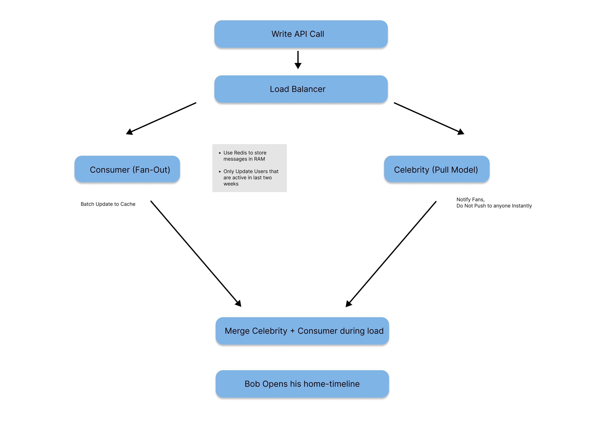

# Design Doc for Small Twitter v.1 

### Context and Scope
The intention of this project is to create a social media platform
scaled to accommodate a large scale of active users. The estimate scope of this project is: 
* Total user: 3 billion
* (DAU)Online user 5-10%: 300 millions
* Concurrent user: 50 million
* Peak user: 500 millions

### Goals
* Software can handel a large amount of traffic  
* Implement two major microservices: 
  * Sharing Information: Users can post messages, delete, and repost
  * User Registration and Management: Users can register account, follow each other
  * Timeline: Users can visualize a complete timeline from their own 
  tweet + tweet from followed account in chronological order
* execute eventual consistency 

### System Design 
- #### Overview
  - Design FlowChart for timeline microservices:
  
  
  - Challenges: 
    - Maximize Reduction of Latency: 
      - Celebrity (Pull Model): How to Handel O(n) read from fans? Notify all fans, but do not push the message to their redis chart. Merge it during the load-time for the home timeline.  
      - For Consumers (Push Model): How to view home timeline without latency? Caching methods batch update new tweets
  and precompute the timeline for every user. 
    - Conserve space in RAM: 
      - Only update and precompute the timeline for users active within 2 weeks only. 
      
  - #### Front-End Design 
    - React would be used to design the front-end of this project 
  - #### API Design
    - Check readMe.md for Specified API Design 

  - #### Data Storage Methods
    - PostgresSQl would be used as database using JPA method 
  - #### Caching 
    - Use Redis to Implement caching methods

### Some Thoughts About Version 2
  - Use Apache Beam to implement MapReduce Model
  - Expand on microservices presented: search timeline (indexing tweet 
to receive low-latency query result), advertisement (How)